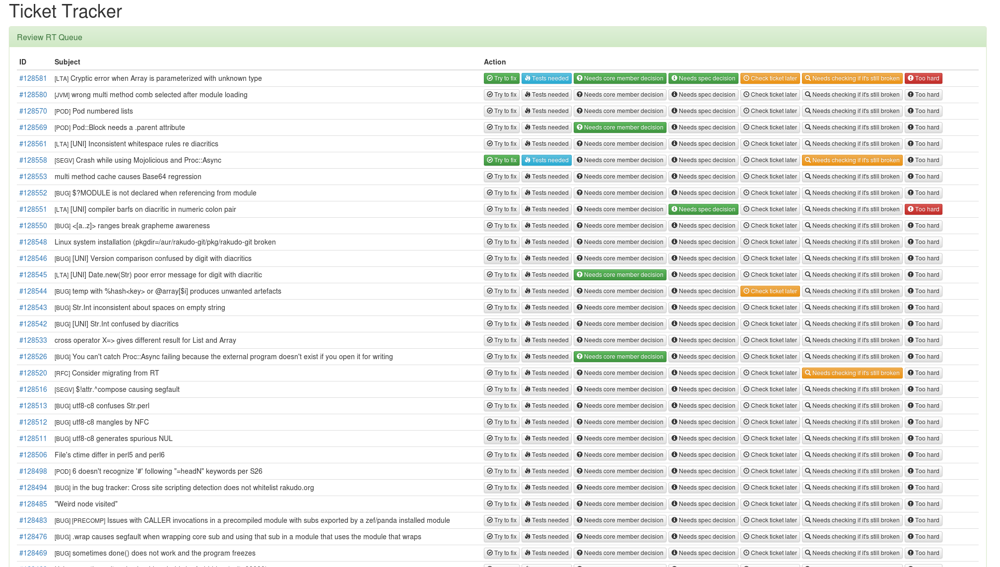

# Ticket Tracker

RT ticket status helper tool

## Screenshot

[see enlarged](https://raw.githubusercontent.com/zoffixznet/perl6-Ticket-Trakr/master/screenshot.png)

## RT Login/Pass

Run this in the repo checkout:

    cp secret-template.txt secret.txt

Then open the `secret.txt` file and enter your own RT user/login. If your
regular credentials don't work, go to
[https://rt.perl.org/User/Prefs.html](https://rt.perl.org/User/Prefs.html)
and set up the password in `CLI Password` section.

## Usage

Run `./start-app.p6` then visit `http://localhost:3000` to access the app's
interface and click `Load RT Tickets`. Note: it may take a bit for the
app to compile on the first run. And the tickets page takes quite a while
to load (RT is slow).

## Installation

This software is developed to work on Debian Linux (and it's derivatives,
Ubuntu, Bodhi Linux, etc.). It may work on other OSes, but no official
support is provided.

You can run [Debian](https://www.debian.org/distrib/)
in a [Virtual Box](https://www.virtualbox.org/wiki/Downloads). After a clean
install, run:

    sudo apt-get update
    sudo apt-get -y upgrade
    sudo apt-get -y install build-essential git curl
    \curl -L https://install.perlbrew.pl | bash
    git clone https://github.com/tadzik/rakudobrew ~/.rakudobrew
    echo 'source ~/perl5/perlbrew/etc/bashrc' >> ~/.bashrc
    echo 'export PATH=~/.rakudobrew/bin:~/.rakudobrew/moar-nom/install/share/perl6/site/bin:$PATH' >> ~/.bashrc
    source ~/.bashrc
    perlbrew install perl-stable -Duseshrplib -Dusemultiplicity
    perlbrew switch perl-stable # replace perl-stable which version installed in the above step
    perlbrew install-cpanm
    rakudobrew build moar
    rakudobrew build zef

Then put this repo somewhere and install its deps:

    mkdir ~/.TicketTracker
    cd ~/.TicketTracker
    git clone https://github.com/zoffixznet/perl6-Ticket-Trakr .
    ./install-deps

# REPOSITORY

Fork this module on GitHub:
https://github.com/zoffixznet/perl6-Ticket-Trakr

# BUGS

To report bugs or request features, please use
https://github.com/zoffixznet/perl6-Ticket-Trakr/issues

# AUTHOR

Zoffix Znet (http://zoffix.com/)

# LICENSE

You can use and distribute this module under the terms of the
The Artistic License 2.0. See the `LICENSE` file included in this
distribution for complete details.
